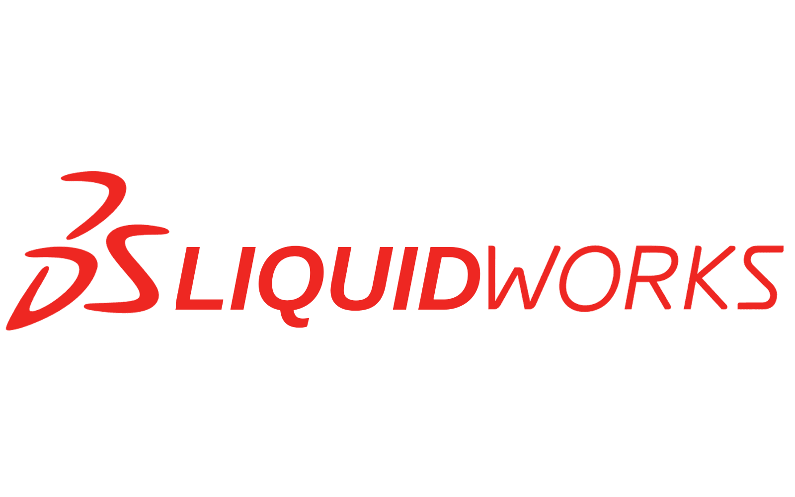
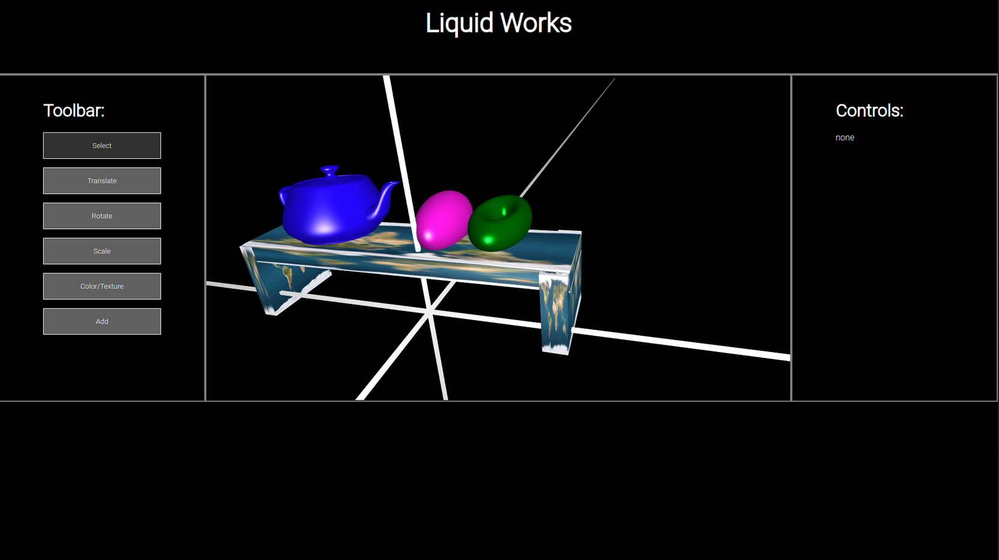

# LiquidWorks
*Advanced* CAD software

 
Liquid Works (inspired by [solidworks](https://www.solidworks.com/)) is a basic Computer-Aided design program that aims to allow users to import and modify objects using basic tools. These tools include the following. 

* translation
* rotation
* scaling
* shading
* color
* custom textures

In addition, we allow the user to add custom `.obj` files to the scene as well as primative shapes like cubes, spheres, and toruses.

Below is a screenshot of the basic interface.



## Running

In order to run the code, we recommend you use [live-server](https://www.npmjs.com/package/live-server). However you can also use an IDE to preview, or serve the files statically.

Installing live-server:
```sh
npm i -g live-server
```

Now you can go the the root of the project directory and use the `live-server` command to start the web app.

```
$ live-server
Serving "/home/rory/dev/CS174A/project" at http://127.0.0.1:8080
Ready for changes
...
```
## Usage

The basic flow of operations when editing is as follows.

1. Add an object to the scene. This can either be a primative or custom `.obj` file.
2. Select the object using the select tool. This will allow you to use all available tools on the object.
3. Select a tool and begin using it.

Below are specific instructions on how to use each tool.

### Selection

To select an object, you can simply click on it once you are in select mode. The object will get slightly darker to reflect its selection. This will give you access to the rest of the available tools. When using tools, they will only affect the currently selected object.

>Note: custom `.objs` have bounding boxes that might not encompas the entire object. To mitigate this, you might have to click near the center to select the object.

### Translation

Once in translate mode, you can simply click on the selected object and drag it anywhere on the screen. Its position will be updated to match that of your mouse. To move the object throughout the Z dimension, you will have to rotate the perspective of the camera (done in select mode).

When you move your object, its values will be reflected in the controls on the right sidebar. Additionally, you can update these values directly to get more fine grained control over the position.

### Rotation

In rotate mode, you can rotate the object around all three axes. First select the checkboxes on the right that correspond to the axes you want to rotate around. For example if you wanted to rotate around the x axis, you would select the leftmost checkbox only.

Next you can drag your mouse across the screen. The angle between the point of reference and of the cursors X position corresponds to the rotation of the object.

Additionally, as with translation, you the rotation of the object around each axis is reflected in the control panel. You can directly change the values in the control panel to rotate the object more precisely.

### Scaling

Similarly to rotation and translation, you are able to scale the objects in all three axis using both the mouse curser and manual inputs. The scaling updates realtime by taking into account stretching up to the mouse curser or compressing when stretched left or down.

### Colors, Shaders, and Textures

The user is able to use a color picker in order to change the color of the selected object. The user can also choose between a phong and gouraud shader. There is also the option to import your own custom texture if you wish to have a unique print or image displayed, it just is required that the image is square and the pixel amount is a power of two.  

### Adding objects to the scene

The user starts with a blank scene and is able to add cubes, spheres, and toruses which are built in. These object are mutable so they also represent rectangular prisms and elipsoids. The user also has the ability to import any custom shape that is in the file format obj. Custom objects will have a rectangular prism bounding box around them for transformations as well as for selection. 


## More
check out our presentation [slides](https://docs.google.com/presentation/d/1uyPM7ad5gW8sJO4-lVXb_T4_4vzY0gbeMiJJafwrBkQ/edit#slide=id.g250f042911b_3_7)

## Credits
Authors: Rory Hemmings and Caolinn Hukill.
Final project for UCLA CS174A Spring 2023.
